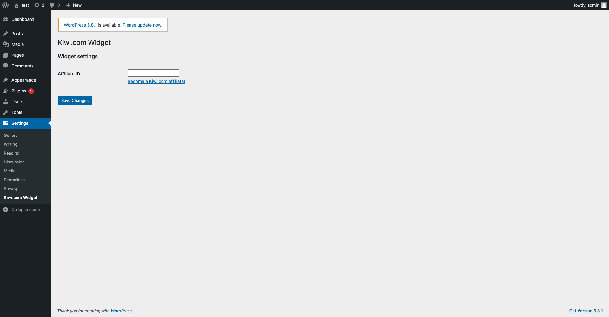
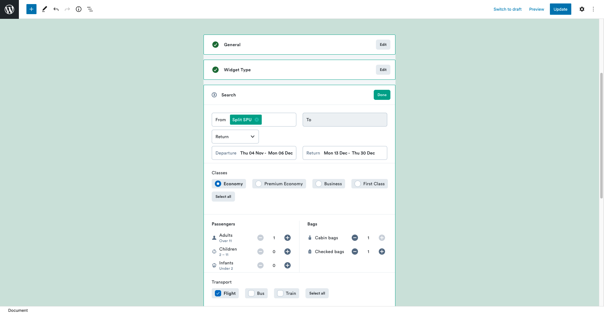
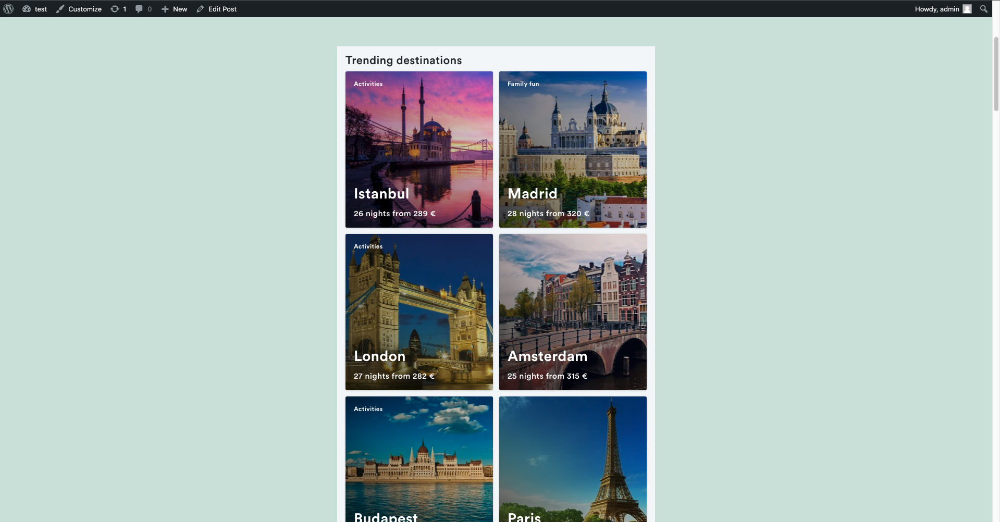

# Cheap Flights By Kiwi<nowiki/>.com

Contributors: tequilawidget

Tags: plugin, widget, travel, blog, engagement, affiliate, booking, attractions

Requires at least: 5.0

Requires PHP: 5.4

Tested up to: 5.8

Stable tag: 1.0.0

License: GPLv3 or later

License URI: https://www.gnu.org/licenses/gpl-3.0.html

## Description

Are you a travel writer, blogger, photographer, or do you just have a website where you share travel related content? Do you have many website visitors that would benefit from the travel booking plugin? If both answers are Yes — check out the Kiwi<nowiki/>.com WordPress plugin created by the travel tech company Kiwi<nowiki/>.com.

Complement your content with Kiwi<nowiki/>.com cheap flights and earn a commission for each purchase. [Widgets](https://partners.kiwi.com/updated-kiwi-com-widget-makes-joining-the-travel-market-easy/?utm_source=wpplugin&utm_medium=marketplace&utm_campaign=widgets-wp-plugin) are highly customizable and easy to set up. Help your visitors search for their dream destination.

This plugin helps you to promote the destinations you mentioned in your blog or article and redirects the user straight to the Kiwi<nowiki/>.com booking page, to easily book the selected trip. You can adjust the widgets and select the exact airport, city, date, or mode of transport. The plugin is easy to setup and use, straight from your WordPress administration page.

Registration to [Tequila](https://partners.kiwi.com/our-solutions/tequila/?utm_source=wpplugin&utm_medium=marketplace&utm_campaign=widgets-wp-plugin), Kiwi<nowiki/>.com partners portal, is free and there’s no additional cost for you as Kiwi<nowiki/>.com is the merchant of record. You can only benefit, while monetizing your website traffic and earning 3% commission for every confirmed booking Kiwi<nowiki/>.com sells to your users.

## How to set up the Kiwi<nowiki/>.com WordPress plugin?

There are five simple steps that separate you from monetizing your passion for travel shared on your website with Kiwi<nowiki/>.com.

1. Log in (or sign up, if you don’t have an account yet) to the Kiwi<nowiki/>.com partners portal [Tequila](https://tequila.kiwi.com/portal/login).
2. In Tequila, select My solutions and create new “Kiwi<nowiki/>.com Widget” solution and give it a name.
3. Once created, copy the AffilID from the newly created solution details.
4. Switch to your WordPress site, download Kiwi<nowiki/>.com Widget and paste your AffilID to plugins’ settings to track your traffic.
5. Add a widget to your page(s), configure it as needed, and enjoy the earned commission!

## About Kiwi<nowiki/>.com — why we have the cheapest flight tickets

In case you don’t know Kiwi<nowiki/>.com – it’s a travel tech company, founded back in 2012. Kiwi<nowiki/>.com has a vast database of more than 800 carriers, including air and ground, all around the world. The company uses the algorithm of Virtual Interlining to combine all these carriers into unique itineraries that other travel search engines simply can’t see.

## Screenshots

If you have any questions or issues please reach out to our dedicated support team through the help section in partner portal Tequila.

## Changelog

= 1.0 =

- Initial release
